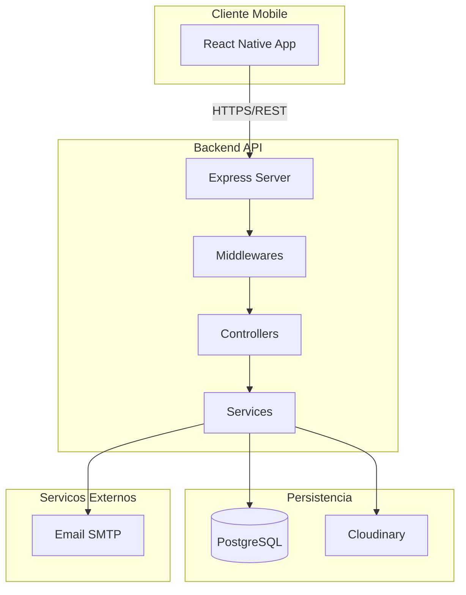
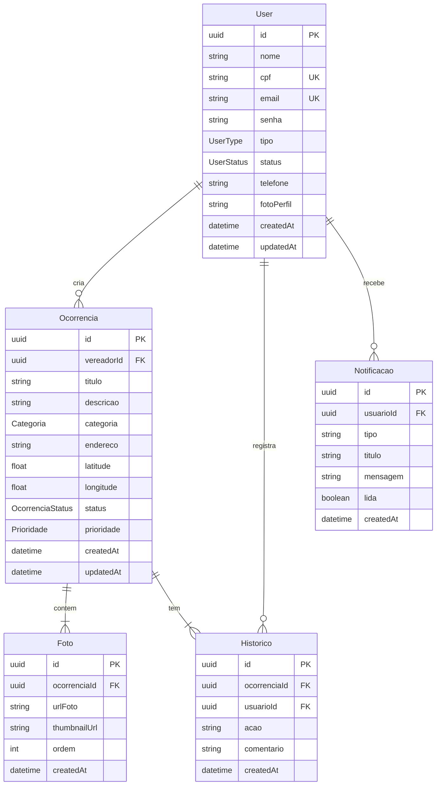
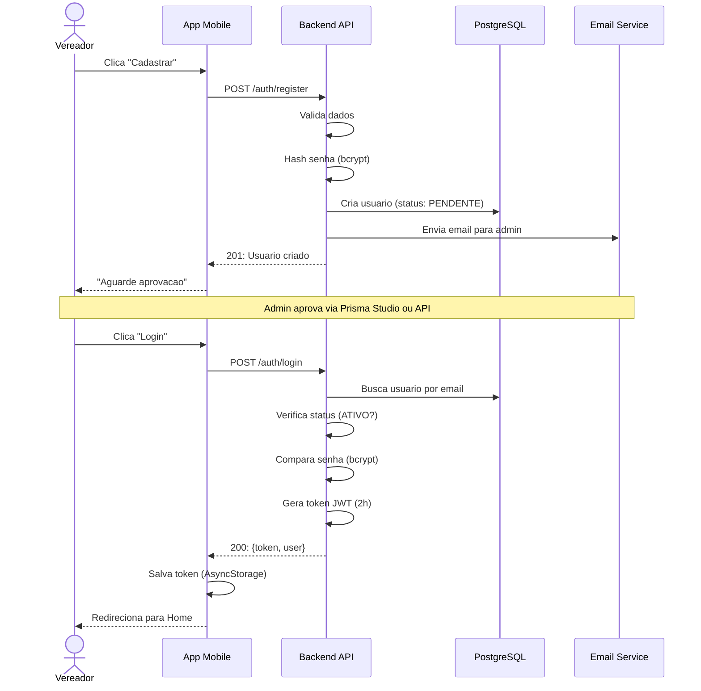
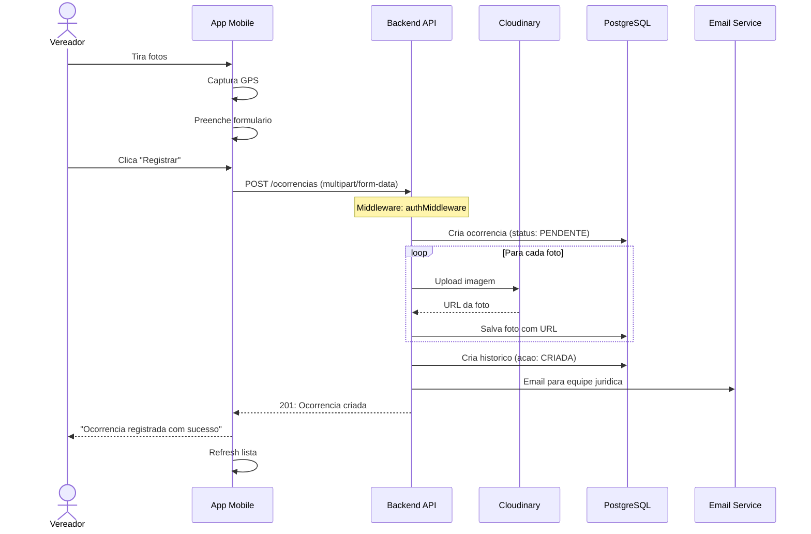
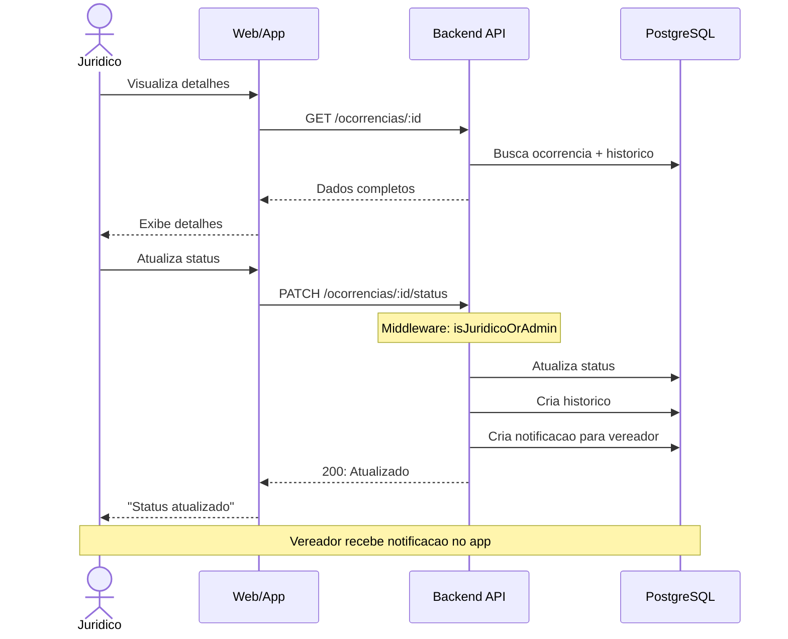

# Arquitetura do Sistema - Ocorrencias Urbanas

## Visao Geral

Sistema completo para gestao de ocorrencias urbanas, permitindo que vereadores registrem problemas com fotos e localizacao GPS, encaminhando para analise juridica e acompanhamento administrativo.

## Stack Tecnologico Implementado

### Backend
- **Node.js 18+** - Runtime JavaScript
- **Express 4.18** - Framework web
- **PostgreSQL** - Banco de dados relacional
- **Prisma ORM 5.7** - ORM type-safe
- **JWT** - Autenticacao stateless
- **Cloudinary** - Armazenamento de imagens
- **Nodemailer** - Envio de emails
- **Bcrypt** - Hash de senhas
- **Express-validator** - Validacao de dados
- **Express-rate-limit** - Rate limiting
- **Multer** - Upload de arquivos

### Mobile
- **React Native 0.73** - Framework mobile
- **Expo 50** - Toolchain e SDK
- **React Navigation 6** - Navegacao
- **Axios** - Cliente HTTP
- **AsyncStorage** - Persistencia local
- **Expo Camera** - Captura de fotos
- **Expo Image Picker** - Galeria de fotos
- **Expo Location** - GPS e geolocalizacao
- **React Native Maps** - Mapas

## Arquitetura de Alto Nivel



---

## Tipos de Usuarios e Permissoes

### ADMIN
**Funcoes:**
- Aprovar/rejeitar cadastros de vereadores
- Gerenciar usuarios (ativar/desativar/deletar)
- Visualizar todas as ocorrencias
- Acessar estatisticas completas
- Todas as permissoes de JURIDICO

**Rotas Exclusivas:**
- `GET /api/users/pending`
- `PATCH /api/users/:id/approve`
- `PATCH /api/users/:id/deactivate`
- `GET /api/users`
- `DELETE /api/ocorrencias/:id` (qualquer ocorrencia)

### VEREADOR
**Funcoes:**
- Criar ocorrencias com fotos e GPS
- Visualizar apenas suas proprias ocorrencias
- Deletar ocorrencias pendentes
- Acompanhar status e historico
- Receber notificacoes de atualizacoes

**Rotas Acessiveis:**
- `POST /api/ocorrencias`
- `GET /api/ocorrencias` (apenas suas)
- `GET /api/ocorrencias/:id` (apenas suas)
- `DELETE /api/ocorrencias/:id` (apenas pendentes)
- `GET /api/notificacoes`

### JURIDICO
**Funcoes:**
- Visualizar todas as ocorrencias
- Atualizar status das ocorrencias
- Adicionar comentarios/pareceres
- Acessar estatisticas
- Receber emails de novas ocorrencias

**Rotas Exclusivas:**
- `PATCH /api/ocorrencias/:id/status`
- `GET /api/ocorrencias/stats`
- `GET /api/ocorrencias` (todas)

---

## Modelo de Dados (ERD)



### Enums

```typescript
UserType: ADMIN | VEREADOR | JURIDICO
UserStatus: PENDENTE | ATIVO | INATIVO
OcorrenciaStatus: PENDENTE | EM_ANALISE | RESOLVIDO | REJEITADO
Prioridade: BAIXA | MEDIA | ALTA
Categoria: INFRAESTRUTURA | ILUMINACAO | LIMPEZA | SAUDE |
           EDUCACAO | SEGURANCA | TRANSPORTE | MEIO_AMBIENTE | OUTROS
```

---

## Fluxos do Sistema

### Fluxo de Autenticacao



### Fluxo de Criacao de Ocorrencia



### Fluxo de Atualizacao de Status



---

## Arquitetura Backend

### Camadas

```
Request → Middleware → Routes → Controllers → Services → Database
                                                ↓
                                          External APIs
```

### Estrutura de Pastas

```
backend/
├── prisma/
│   ├── schema.prisma           # Schema do banco
│   └── migrations/             # Migrations versionadas
├── src/
│   ├── config/
│   │   └── database.js         # Cliente Prisma
│   ├── controllers/
│   │   ├── auth.controller.js  # Autenticacao
│   │   └── ocorrencia.controller.js
│   ├── middleware/
│   │   └── auth.middleware.js  # JWT + autorizacao
│   ├── routes/
│   │   ├── auth.routes.js      # Rotas publicas
│   │   ├── user.routes.js      # Admin only
│   │   ├── ocorrencia.routes.js
│   │   └── notificacao.routes.js
│   ├── services/
│   │   ├── email.service.js    # Nodemailer
│   │   └── upload.service.js   # Cloudinary
│   └── server.js               # Entry point
├── .env                        # Variaveis (gitignored)
├── .env.example                # Template
└── package.json
```

### Middlewares

```javascript
// 1. Rate Limiting (global)
windowMs: 15min, max: 100 req/IP

// 2. CORS
origin: process.env.FRONTEND_URL || '*'

// 3. Body Parsers
express.json() + express.urlencoded()

// 4. Auth Middleware
authMiddleware: Valida JWT, extrai userId e userType

// 5. Authorization Middlewares
isAdmin: Apenas ADMIN
isJuridicoOrAdmin: JURIDICO ou ADMIN

// 6. Validation Middleware
express-validator: Valida body, params, query
```

---

## Arquitetura Mobile

### Navegacao

```
AuthNavigator (Stack)
├── LoginScreen
└── RegisterScreen

AppNavigator (Bottom Tabs)
├── HomeStack (Stack)
│   ├── HomeScreen
│   └── DetalhesOcorrenciaScreen
├── NovaOcorrenciaScreen
└── ProfileScreen
```

### Context API

```javascript
AuthContext
├── state: { user, token, isLoading }
├── actions:
│   ├── login(email, senha)
│   ├── register(userData)
│   ├── logout()
│   └── loadUser()
```

### Estrutura de Pastas

```
mobile/
├── src/
│   ├── screens/
│   │   ├── auth/
│   │   │   ├── LoginScreen.js
│   │   │   └── RegisterScreen.js
│   │   ├── home/
│   │   │   └── HomeScreen.js
│   │   ├── ocorrencias/
│   │   │   ├── NovaOcorrenciaScreen.js
│   │   │   └── DetalhesOcorrenciaScreen.js
│   │   └── profile/
│   │       └── ProfileScreen.js
│   ├── navigation/
│   │   └── AppNavigator.js
│   ├── context/
│   │   └── AuthContext.js
│   └── services/
│       └── api.js              # Axios instance
├── App.js
└── package.json
```

---

## Seguranca

### Autenticacao

- Senhas: bcrypt (salt rounds: 10)
- JWT: HS256, expiracao 2h
- Token no header: `Authorization: Bearer {token}`

### Autorizacao

Matriz de permissoes:

| Rota | VEREADOR | JURIDICO | ADMIN |
|------|----------|----------|-------|
| POST /ocorrencias | Sim | Nao | Nao |
| GET /ocorrencias | Apenas suas | Todas | Todas |
| PATCH /ocorrencias/:id/status | Nao | Sim | Sim |
| GET /users/pending | Nao | Nao | Sim |
| PATCH /users/:id/approve | Nao | Nao | Sim |

### Validacao

Todas as rotas validam:
- Tipos de dados corretos
- Campos obrigatorios presentes
- Formatos validos (email, CPF, etc)
- Tamanhos de arquivo

### Rate Limiting

100 requisicoes por IP a cada 15 minutos.

---

## Decisoes Arquiteturais

### Por que Prisma em vez de SQL puro?

- Type-safety com TypeScript
- Migrations automaticas e versionadas
- Query builder intuitivo
- Prevencao de SQL injection
- Introspeccao do schema
- Prisma Studio para debug

### Por que JWT stateless?

- Escalabilidade: sem estado no servidor
- Mobile-friendly: armazenamento local facil
- Padrao da industria
- Suporte a expiracao automatica

### Por que Cloudinary?

- Free tier generoso (25GB)
- CDN global automatico
- Transformacoes de imagem (thumbnails)
- Otimizacao automatica
- URLs permanentes

### Por que Expo?

- Setup rapido sem configuracao nativa
- Over-the-air updates
- Builds na nuvem (EAS)
- Acesso a APIs nativas (camera, GPS)
- Hot reload

---

## Performance

### Backend

- Indices no banco (id, email, cpf, vereadorId)
- Paginacao: 10 itens por pagina (padrao)
- Select apenas campos necessarios
- Eager loading de relacoes com `include`
- Cache de queries (futuro: Redis)

### Mobile

- AsyncStorage para cache de token
- Pull-to-refresh nas listas
- Loading states em todas as requisicoes
- Imagens otimizadas antes do upload
- Lazy loading de imagens

---

## Monitoramento (Recomendado para Producao)

### Logs
- Winston ou Pino para logs estruturados
- Diferentes levels: error, warn, info, debug
- Rotacao de logs

### Metricas
- Tempo de resposta das APIs
- Taxa de erro
- Uptime
- Uso de memoria/CPU

### Alertas
- Email quando erro critico
- Slack quando servico cai
- Dashboard de saude do sistema

---

## Roadmap

### v1.1.0 (Proximo)
- Notificacoes push (Firebase)
- Edicao de ocorrencias
- Dashboard web para admin
- Testes automatizados

### v1.2.0
- Modo offline + sincronizacao
- Busca full-text
- Filtros avancados
- Relatorios PDF

### v2.0.0
- App iOS
- Graficos e estatisticas
- Sistema de comentarios
- Dark mode
- Multiplos idiomas

---

## Referencias

- [Documentacao Prisma](https://www.prisma.io/docs)
- [Express Best Practices](https://expressjs.com/en/advanced/best-practice-security.html)
- [React Native Docs](https://reactnative.dev/docs)
- [Expo Docs](https://docs.expo.dev)
- [JWT Best Practices](https://tools.ietf.org/html/rfc8725)
- [API_REFERENCE.md](./API_REFERENCE.md) - Documentacao completa da API
